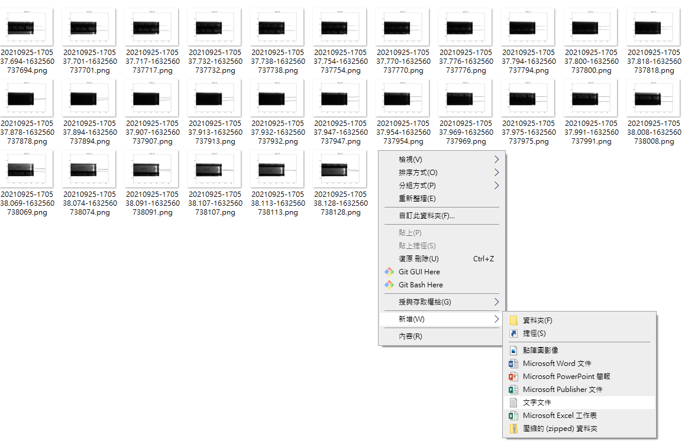
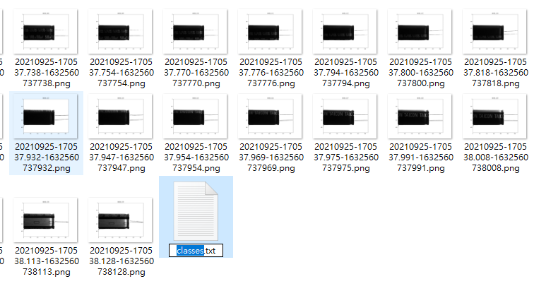
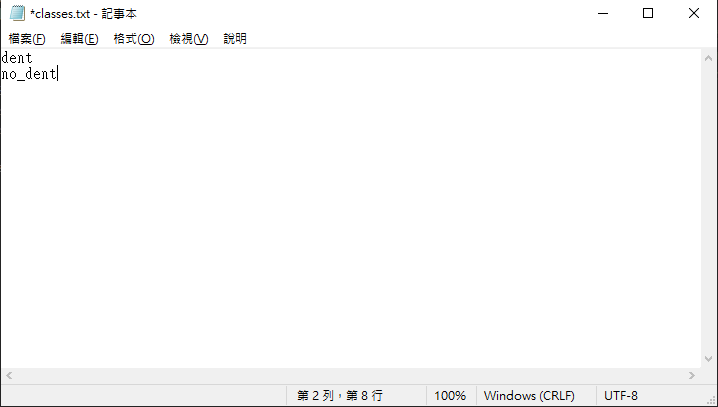
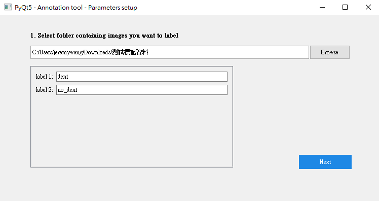
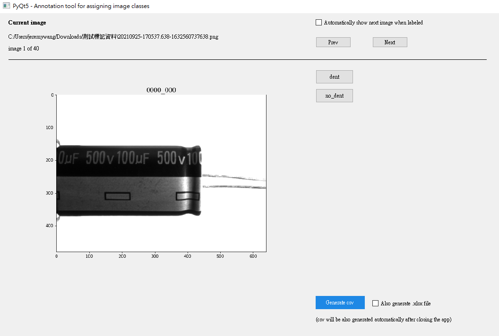

# TaiconClsLabeler簡介
這個是我拿網路上的code來改的影像標記(分類)軟體，你們可以用用看，我這個我可以客製化幅度比較大，快捷鍵跟一些新功能都可以評估加入。

# 使用方法
1. 在影像資料夾中加入classes.txt檔案



2. 在classes.txt寫入類別

```
dent
no_dent
```

3. 開啟標註軟體並指定圖檔資料夾



4. 開啟標註軟體並指定圖檔資料夾


# 快捷鍵
1. Prev: p or a
2. Next: n or d
3. Labeing: 1~9

# Deploy
```
pyinstaller main.spec
```
# Version Note
## v1: 
1. Change to save txt (`.cls.txt`) file
2. Use classes.txt to define clabel
3. remove functions: add labels
4. remove functions: `move` and `copy` mode

## v2: 
1. Add go to function (recommended by Yun)
2. Add not save check
3. remove functions: generate csv btn


<!-- # PyQt Image Annotation Tool

This app is used to label images in a given directory.
Labeled images can be moved or copied into sub-directories, which are named as assigned labels.
The app is just a single Python script with GUI.


## What can this app do
For example you have folder ./data/images/ with a lot of images and you need to assign some
label(s) to these images.

- it can assign multiple labels to one image
- it allows you to choose number and names of your labels
- it can move/copy images to folders that are named as desired labels.
- it can generate .csv file with assigned labels.
- it can generate .xlsx file with assigned labels.
- all settings are handled via GUI

## Installation and usage

1. Clone the project:
    ```bash
    git clone https://github.com/robertbrada/PyQt-image-annotation-tool.git
    ```

2. Enter the directory and install the dependencies (you might need to use ```pip3``` instead of ```pip```):
    ```bash
    cd PyQt-image-annotation-tool
    pip install -r requirements.txt
    ```
3. Run the app (use ```python3``` for Python 3)
   ```bash
    python main.py
    ```

## Keyboard shortcuts

- N: Next image
- P: Previous image
- 1-9: Select label

## Contributing

Pull requests are welcomed. -->
